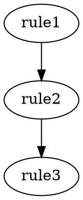

# Symbolica Rule Visualization

A comprehensive visualization toolkit for analyzing Symbolica rule structures, dependencies, and execution order. This helps users understand how their rules will be processed before deployment.

## Features

- **AST Visualization**: Shows how rule conditions are parsed into abstract syntax trees
- **DAG Analysis**: Visualizes rule dependencies and execution order
- **Performance Analysis**: Identifies parallelization opportunities and bottlenecks
- **HTML Reports**: Generates comprehensive analysis reports
- **Graphviz Export**: Creates visual dependency graphs
- **JSON Export**: Exports analysis data for further processing

## Quick Start

```python
from symbolica import Engine
from visualization import RuleVisualizer

# Load your rules
engine = Engine.from_yaml(yaml_content)

# Create visualizer
visualizer = RuleVisualizer(engine)

# Quick summary
visualizer.quick_summary()

# Show dependency analysis
visualizer.show_dag()

# Generate comprehensive report
visualizer.generate_report('my_rules_analysis.html')
```

## Installation

The visualization package works with the core Symbolica library. For enhanced features, install optional dependencies:

```bash
cd visualization/
pip install -r requirements.txt
```

Optional dependencies include:
- `graphviz` - For generating visual dependency graphs
- `plotly` - For interactive visualizations  
- `matplotlib` - For statistical plots

## Core Components

### RuleVisualizer
Main interface for rule analysis:

```python
from visualization import RuleVisualizer

visualizer = RuleVisualizer(engine)

# Quick analysis
visualizer.quick_summary()
visualizer.show_ast("rule_id")  # AST for specific rule
visualizer.show_dag()           # Dependency analysis

# Detailed analysis
analysis = visualizer.analyze_rule("rule_id")
summary = visualizer.get_execution_summary()

# Export results
visualizer.generate_report('analysis.html')
visualizer.export_json('data.json')
visualizer.export_graphviz('graph.dot')
```

### ASTVisualizer
Analyzes rule condition structures:

```python
from visualization import ASTVisualizer

ast_viz = ASTVisualizer(rules)

# Parse condition to AST
ast_tree = ast_viz.parse_condition("age >= 18 and income > 50000")

# Print readable tree
ast_viz.print_rule_ast("rule_id")
```

### DAGVisualizer
Analyzes rule dependencies:

```python
from visualization import DAGVisualizer

dag_viz = DAGVisualizer(rules)

# Show execution order
dag_viz.print_execution_order()

# Critical path analysis
dag_viz.print_critical_path()

# Generate Graphviz
dot_content = dag_viz.to_graphviz()
```

## Analysis Types

### 1. Execution Order Analysis
Shows the order rules will execute based on dependencies and priorities:

```
Level 0: validate_data [priority: 1000]
Level 1: check_eligibility [priority: 900] (depends on: validate_data)
Level 2: calculate_offer [priority: 800] (depends on: check_eligibility)
```

### 2. Dependency Graph
Visualizes which rules depend on others:

- **Dependencies**: Rules this rule waits for
- **Dependents**: Rules that wait for this rule
- **Independent rules**: Rules with no dependencies

### 3. Critical Path Analysis
Identifies the longest dependency chain:

```
Critical Path: validate_data → check_eligibility → calculate_offer → final_decision
Chain length: 4 rules
```

### 4. Parallelization Opportunities
Shows which rules can execute simultaneously:

```
Level 2: 3 rules can execute in parallel
Rules: loyalty_bronze, loyalty_silver, loyalty_gold
```

### 5. AST Structure Analysis
Shows how conditions are parsed:

```
Rule: loan_eligibility
Condition: age >= 18 and income > 50000

AST Structure:
  BoolOp (And):
    Compare:
      Field: age
      Ops: GtE
      Values: Value: 18
    Compare:
      Field: income  
      Ops: Gt
      Values: Value: 50000
```

## Generated Reports

### HTML Report
Comprehensive analysis with:
- Rule statistics and summary
- Execution order breakdown
- Critical path analysis
- Individual rule details with AST
- Parallelization opportunities
- Performance implications

### JSON Export
Machine-readable analysis data:
```json
{
  "rules": [...],
  "execution_summary": {
    "statistics": {...},
    "execution_levels": [...],
    "critical_path": [...],
    "parallelization_opportunities": [...]
  },
  "rule_analyses": {...}
}
```

### Graphviz DOT
Visual dependency graph:


Render with: `dot -Tpng graph.dot -o dependencies.png`

## Examples

### Basic Usage
```bash
cd visualization/examples/
python basic_visualization.py
```

### Advanced Analysis
```bash
cd visualization/examples/
python advanced_analysis.py
```

### Quick Analysis from YAML
```python
from visualization import visualize_from_yaml, visualize_from_file

# From YAML string
visualizer = visualize_from_yaml(yaml_content)

# From YAML file
visualizer = visualize_from_file('rules.yaml')
```

## Performance Insights

The visualizer helps identify:

1. **Sequential Bottlenecks**: Rules that must execute one after another
2. **Parallelization Potential**: Groups of independent rules
3. **Dependency Chains**: Long sequences that may impact performance
4. **Execution Efficiency**: Average rules per execution level

### Example Analysis Output
```
Rule Set Statistics:
Total rules: 15
Execution levels: 6
Total dependencies: 8
Independent rules: 3
Parallelization potential: 2.5 rules per level
Critical path length: 4 rules
```

## Use Cases

### Pre-Deployment Analysis
- Validate rule structure before production
- Identify potential performance issues
- Ensure logical rule dependencies

### Rule Set Optimization
- Find parallelization opportunities
- Reduce critical path length
- Optimize rule priorities

### Documentation Generation
- Create visual documentation of rule logic
- Generate reports for stakeholders
- Export analysis for compliance

### Debugging Complex Rules
- Understand why rules fire in specific order
- Trace dependency chains
- Identify circular dependencies

## Integration with Symbolica

The visualizer works seamlessly with Symbolica engines:

```python
from symbolica import Engine, Facts
from visualization import RuleVisualizer

# Load rules
engine = Engine.from_directory('rules/')

# Analyze structure
visualizer = RuleVisualizer(engine)
visualizer.show_dag()

# Test with sample data
facts = Facts({'age': 25, 'income': 60000})
result = engine.reason(facts)

# Compare expected vs actual execution
print(f"Reasoning: {result.reasoning}")
```

## Limitations

- AST parsing uses Python's `ast` module with fallback to regex
- Dependency detection is heuristic-based (field access analysis)
- Complex condition parsing may not capture all edge cases
- Graphviz rendering requires external `dot` command

## Contributing

To extend the visualization package:

1. Add new analysis methods to existing classes
2. Create new visualizer classes for specific needs
3. Enhance HTML report generation
4. Add support for new export formats

The visualization package is designed to be simple and extensible while providing powerful insights into rule structure and behavior. 